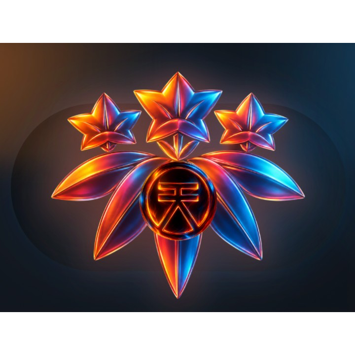

# Minamoto Wallet

A Touch-ID-protected, password-encrypted Ed25519 wallet for the
**Minamoto** mainnet (Iroha 3 / Sora Nexus). Native macOS app with a
local web UI rendered inside a WKWebView — no browser exposure, no
remote daemon, no Apple Developer ID required.

> **Phase 1 wallet** — runs against `https://minamoto.sora.org` today.
> Confidential transfer / unshield (Phase 2) lands when the Halo2-IPA
> prover is integrated; see [`ZK_ROADMAP.md`](./ZK_ROADMAP.md).



## Features

| Capability | Status |
|---|---|
| Generate / restore / delete wallet (BIP39 24-word mnemonic) | ✅ |
| Password-encrypted seed (argon2id + AES-256-GCM) | ✅ |
| Touch-ID-gated destructive operations (delete) | ✅ |
| Send public XOR (Transfer ISI, auto-Register prepended on first send) | ✅ |
| Shield public XOR → confidential note | ✅ |
| `iroha:confidential:v3:` payment-address parsing & generation | ✅ |
| Pay a confidential v3 address (Shield to recipient owner_tag) | ✅ |
| Reveal recovery secrets (mnemonic + raw seed + Iroha private_key) | ✅ |
| Delete-with-mnemonic-check (3 random words from BIP39) | ✅ |
| Distributable `.dmg` installer | ✅ (see Releases) |
| Confidential Unshield / ZkTransfer with real Halo2 proof | 🚧 Phase 2 |

## Install

Download the latest `.dmg` from the **[Releases page](../../releases)**:

1. Double-click the `.dmg`, drag **Minamoto Wallet** to *Applications*.
2. First launch: **right-click → Open** (Gatekeeper bypass — the
   binary is ad-hoc-signed, not Apple-notarized; this is a one-time
   prompt per cdhash).
3. After launch, double-click the icon as normal. Spotlight
   (`Cmd+Space → Minamoto`) also works.

## Build from source

### Prerequisites

- macOS (Sequoia or later) — Touch ID requires Apple Silicon or T2 Mac
- Xcode Command Line Tools (`xcode-select --install`)
- Rust 1.92+ (`curl https://sh.rustup.rs -sSf | sh`)
- Local clone of the **Iroha 3 i23-features branch** in a sibling
  directory: see [§ Path dependencies](#path-dependencies)

### Build + sign + bundle

```bash
# Compile the binary
cargo build --release

# Adhoc-codesign (no Apple Developer ID required)
codesign --force --sign - target/release/minamoto-wallet

# Build the .app bundle (icon + Info.plist + wrapper)
dist/make-app.sh --install     # also copies to /Applications

# Build a distributable .dmg
dist/make-dmg.sh
```

The result lands in `dist/Minamoto-Wallet-0.1.0.dmg`.

### Path dependencies

This project consumes Iroha 3 source crates (`iroha_crypto`,
`iroha_data_model`, etc.) directly from a sibling clone. Until those
crates are published on crates.io for Iroha 3, contributors need:

```bash
# Clone Iroha 3 next to this repo
git clone -b i23-features https://github.com/hyperledger-iroha/iroha \
    ../iroha-source/iroha
```

The `Cargo.toml` references `../iroha-source/iroha/crates/<name>`. We
will switch to git deps in a future release for self-contained builds.

## Architecture

Read these in order to understand the design:

| Document | Topic |
|---|---|
| [`WALLET_DESIGN.md`](./WALLET_DESIGN.md) | Why Touch ID + Keychain → password-encrypted seed |
| [`STATUS.md`](./STATUS.md) | What works today vs blocked |
| [`AUDIT.md`](./AUDIT.md) | Adversarial security review (CRITICAL → LOW findings) |
| [`ZK_ROADMAP.md`](./ZK_ROADMAP.md) | Phase 2 confidential transfer plan |
| [`MIGRATION.md`](./MIGRATION.md) | v1 → v2 keystore migration; future YubiKey 5C path |

### File layout

```
src/
├── main.rs                  # clap CLI dispatch
├── wallet.rs                # generate/restore/unlock/migrate
├── password.rs              # argon2id + AES-256-GCM
├── secure_enclave.rs        # legacy v1 P-256 ECIES wrap (Keychain)
├── biometric.rs             # LAContext Touch ID gate
├── storage.rs               # JSON record schema (v1 + v2)
├── confidential_address.rs  # iroha:confidential:v3: parse + render
├── delete_challenge.rs      # 3-word BIP39 confirmation
├── session.rs               # in-memory password cache (5-min TTL)
├── transfer.rs              # Transfer ISI + auto-Register
├── shield.rs                # Shield ISI + commitment derivation
├── zk_v2.rs                 # Pasta-Fp Poseidon helpers (port of confidential_v2)
├── torii.rs                 # HTTP client for Iroha REST endpoints
├── balance.rs               # /v1/explorer/assets query + display
├── ui.rs                    # tao + wry native window + tiny_http API
└── ui_index.html            # Embedded HTML/JS UI

dist/
├── logo.png                 # Sora 天 lotus
├── make-app.sh              # Build .app bundle
└── make-dmg.sh              # Build distributable .dmg

docs at root:
├── WALLET_DESIGN.md
├── STATUS.md
├── AUDIT.md
├── ZK_ROADMAP.md
└── MIGRATION.md
```

## Security model

- **Seed at rest** — encrypted with a key derived from the user
  password via argon2id (m=64MB, t=3, p=1) and sealed with
  AES-256-GCM. Reading the wallet JSON file gives you nothing without
  the password.
- **Seed in memory** — wrapped in `Zeroizing` from unlock through
  signing; explicit `ZeroizeOnDrop` on `iroha_crypto::PrivateKey`.
- **HTTP server** — bound to `127.0.0.1:7825`, with `Host`-header
  validation (DNS-rebinding defense) and a 5-minute session-cache
  for the unlocked password so signing bursts don't repeat the
  prompt. `Lock` button + auto-expiry clear the cache.
- **Destructive operations** — `delete` requires the user to type 3
  random words from their BIP39 mnemonic plus a Touch ID confirm.
  `reveal-secrets` always re-prompts the password (sudo elevation),
  even if the cache is warm.

For the full threat model, see [`AUDIT.md`](./AUDIT.md).

## Contributing

This is a personal project today (single maintainer, no SLA). PRs and
issues welcome but there's no roadmap commitment. The most useful
contributions:

- Phase 2 ZK integration (Halo2-IPA prover wrapper).
- Cross-platform builds (Linux / Windows once the password-encrypted
  format becomes the only path).
- Notarization workflow (requires Apple Developer ID).

## License

[Apache-2.0](./LICENSE).

## Acknowledgments

- **Soramitsu** for the Iroha 3 protocol and the Sora ecosystem.
- The `tao` + `wry` projects (the lower-level web-view stack from the
  Tauri team).
- The `argon2`, `aes-gcm`, `pasta_curves`, and `blake3` crates that
  do the heavy crypto.

---

> ⚠ **Phase 0/1 wallet, not a financial product.** This software is
> provided as-is, without warranty. The author is not responsible for
> lost funds. The 24-word BIP39 mnemonic written on paper is your
> only disaster-recovery path. Test with small amounts first.
